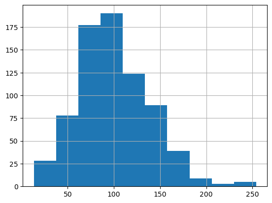
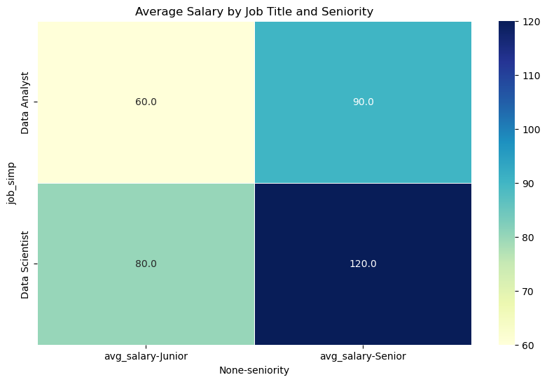
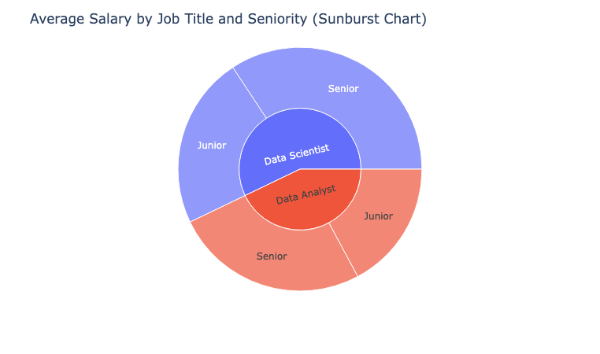
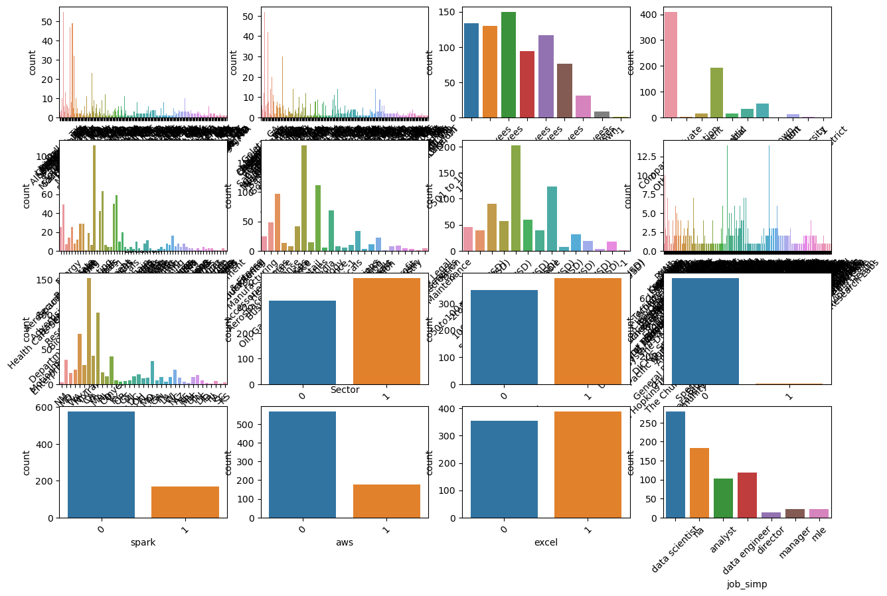
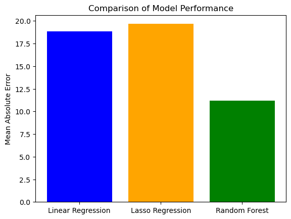
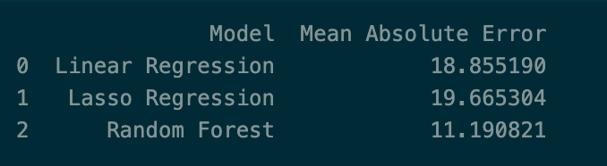

# Data Science Salary Estimator

## Table of Contents

- [Resources](#resources) 
- [Dataset](#dataset)  
  - [Data Collection](#data-collection)
  - [Data Cleaning](#data-cleaning)
- [EDA](#eda)
- [Model Training](#training)
- [Model Evaluation](#model-evaluation)

## Resources

Scraper Github: https://github.com/arapfaik/scraping-glassdoor-selenium

## Data Collection
https://github.com/arapfaik/scraping-glassdoor-selenium

## Data Cleaning

- Parsing Salary Data
- Transforming date attributes
- Removing unwanted attributes
- Added columns for skills

## EDA

- Created pivot tables
- Looked at various categorical data and plotted bar charts of categorical variables
- Some highlights from the analysis

  
     
     

## Model Building

- The data was trained on three models: **OLS Regression Model**, **Lasso Regression Model**, and **Random Forest**.
- The data was split using an 80-20 split

### OLS Regression Model

* **OLS regression** is a linear modeling technique used for predicting a continuous target variable. In our case, it was applied to estimate the salary of a data scientist based on various features.

* **Lasso Regression** is a linear regression model with L1 regularization. It is useful for feature selection and regularization, potentially improving model interpretability. This was used since our EDA showed high correlation between the features.

* **Random Forest** is efficient in handling non-linear relationships and performs well for salary prediction. Parameter tuning was achieved using Grod Search.

## Model Validation

**Metric** - Mean Absolute Error (MAE)

  
       

